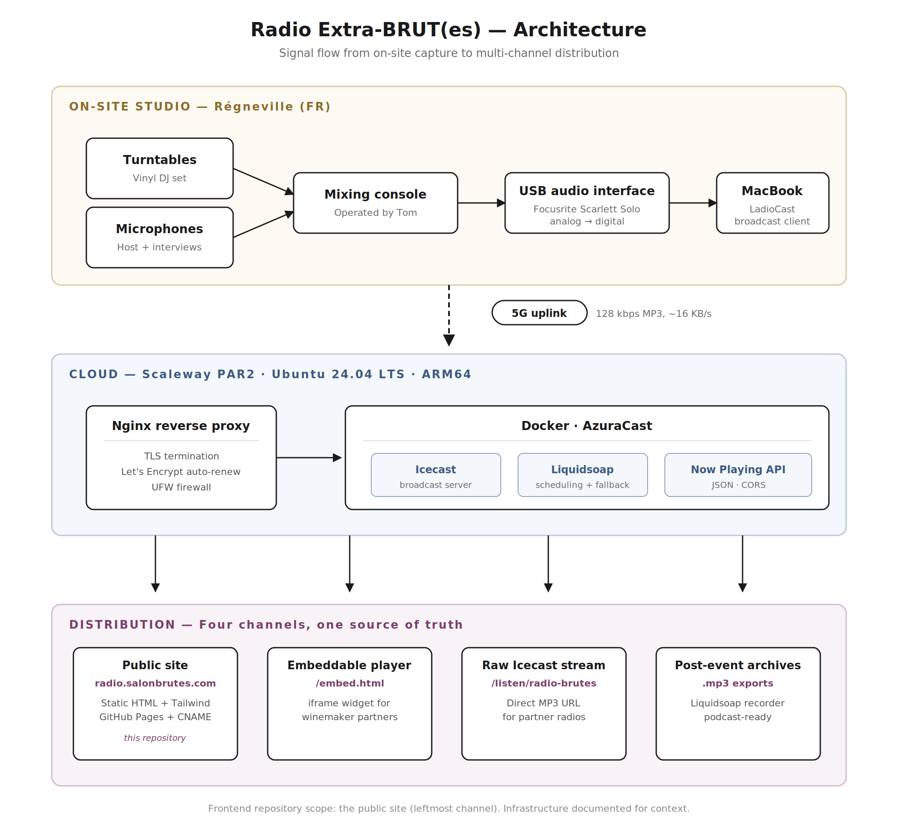

# Radio Extra-BRUT(es)

> An ephemeral web radio broadcast from a natural wine fair in rural France — designed to run for one weekend, on a 5G uplink, with zero-ops tolerance.

[](./LICENSE)
[](https://radio.salonbrutes.com)
[](#tech-stack)



---

## Live

| | |
|---|---|
| Public site | https://radio.salonbrutes.com |
| Raw stream | `https://stream.grandsoir.co/listen/radio-brutes/radio.mp3` |
| On air | Every May during **Salon Extra-BRUT(es)** in Régneville, France |
| Event context | [salonbrutes.com](https://www.salonbrutes.com/) |

<!-- Optional: drop a screenshot at ./assets/screenshot.png -->
<!--  -->

---

## The project

**Radio Extra-BRUT(es)** is the on-site web radio of *Salon Extra-BRUT(es)*, an annual natural wine and cider fair. For one weekend each year, the salon turns into a temporary broadcast studio: live DJ sets on vinyl, interviews with winemakers and cider makers, and field recordings — all streamed to a public site, embeddable widgets for partners, and a direct stream URL for partner radios.

The project is built by a three-person volunteer team. This repository hosts the **public-facing site** — the frontend that listeners land on when they want to tune in, browse the schedule, or share the stream.

The rest of this README documents not only the code in this repo but also the cloud infrastructure behind it — because the product decision that matters here is the **whole chain**, from a turntable needle in Normandy to a listener's browser anywhere.

---

## Problem & constraints

Designing this radio was less a coding problem than a systems and product one. The constraints shaped every decision:

| Constraint | Implication |
|---|---|
| **Ephemeral** — ~72 hours of broadcast per year | No tolerance for a "we'll fix it next release" mindset. Everything ships working or it doesn't ship. |
| **Rural venue** — no wired internet | 5G uplink only. Bitrate, failure modes, and fallbacks had to be sized for a mobile link. |
| **Non-technical on-site team** | The broadcast client needs to work like a desk phone: plug it in, press a button, walk away. |
| **Partner integrations** | Winemaker websites embed our player. Partner radios rebroadcast our stream. Each needs a stable, documented endpoint. |
| **Zero hosting budget** | Total monthly cost had to fit in the price of one bottle of wine. Actual bill: ~€6/month on Scaleway. |
| **Post-event afterlife** | Sessions become podcast episodes the following week. The recording and export pipeline has to exist by design, not as an afterthought. |

---

## Architecture at a glance

The system is three stages chained by a single 5G uplink (see diagram above):

1. **On-site studio** — turntables and microphones feed a mixing console, routed through a USB audio interface into a MacBook running **LadioCast**, which encodes and pushes MP3 to the cloud.
2. **Cloud** — a small ARM64 VPS on **Scaleway** (Paris region) runs **AzuraCast** in Docker, fronted by **Nginx** with Let's Encrypt TLS. AzuraCast wraps **Icecast** for broadcast, **Liquidsoap** for scheduling and fallback, and exposes a Now Playing JSON API.
3. **Distribution** — one source, four channels: the public site (this repo), an embeddable iframe player, the raw Icecast URL for partner radios, and post-event MP3 archives for podcast publication.

---

## Scope of this repository

This repo contains **only the frontend code** for the public site at `radio.salonbrutes.com` — three static HTML pages, two JavaScript files, and assets. The cloud infrastructure, the streaming server configuration, and the on-site broadcast setup live outside this repository but are documented here for context, because together they are what makes the product work.

If you're reviewing this as a portfolio piece, the interesting parts are:

- The **engineering decisions** section (below) — why each layer was chosen, and what was rejected.
- The **frontend code** itself — deliberately minimal, zero build step, accessible, resilient to API and stream failures.
- The fact that a non-trivial multi-channel distribution system was delivered end-to-end by a one-person tech team on a weekend volunteer schedule.

---

## Tech stack

### Frontend (this repo)

| Concern | Choice |
|---|---|
| Language | Vanilla JavaScript (ES2020+), no framework |
| Build step | None — static files served as-is |
| Styling | Tailwind CSS via CDN, custom `brutes-*` palette, `Bricolage Grotesque` + `Inter` (Google Fonts) |
| Pages | `index.html` (landing), `radio.html` (player + schedule), `embed.html` (iframe widget, hand-written CSS) |
| Data sources | AzuraCast Now Playing JSON API (20 s poll, paused on `visibilitychange`); Google Sheets CSV for the programme schedule |
| Audio | Native `<audio>` element, imperative JS control, cache-busting retry, `aria-live` status |
| Accessibility | `aria-label` / `aria-pressed` / `aria-live` / `aria-disabled`, `prefers-reduced-motion` guards, `<dialog>` with ESC + backdrop handling |
| Hosting | GitHub Pages via `CNAME` + `.nojekyll`, with `.htaccess` as a fallback for shared Apache hosting |
| Share | Facebook / WhatsApp / mailto intents; clipboard fallback with `document.execCommand('copy')` |

### Backend & infrastructure

| Layer | Choice | Notes |
|---|---|---|
| Provider | **Scaleway**, region Paris 2 (PAR2) | EU data sovereignty, low latency to French listeners |
| Instance | **DEV1-S / BASIC2-A** (2 vCPU, 2 GB RAM, 20 GB SSD), ARM64 | ~€6/month, 200 Mbps public bandwidth |
| OS | Ubuntu 24.04 LTS (Noble Numbat) | |
| Orchestration | Docker + Docker Compose | |
| Streaming | **AzuraCast** (bundles Icecast + Liquidsoap + web admin + Now Playing API) | |
| Reverse proxy | **Nginx** with Let's Encrypt auto-renewal | TLS termination, HTTPS redirect |
| Firewall | UFW (ports 22, 80, 443, 8000) | |
| Stream format | MP3, 128 kbps | Industry standard for talk + music; ~16 KB/s uplink |
| On-site broadcast client | **LadioCast** (macOS) | |
| Audio interface | **Focusrite Scarlett Solo** (USB) | Alternative evaluated: Behringer UCA222 |
| Domain | `radio.salonbrutes.com` (frontend) + `stream.grandsoir.co` (stream + API) | Split by concern: site on Pages, stream on VPS |

---

## Key engineering decisions

Each of these was a real fork in the road. Noting both the pick and the alternative is more honest than listing a stack.

### 1. AzuraCast over raw Icecast + Liquidsoap

| | |
|---|---|
| **Picked** | AzuraCast (which bundles Icecast, Liquidsoap, a web admin UI, and a Now Playing JSON API in Docker). |
| **Rejected** | Installing Icecast + Liquidsoap directly, writing `icecast.xml` and a `.liq` script by hand. |
| **Why** | Faster time to air, and a documented JSON API the frontend can consume without custom endpoints. The underlying Icecast stream URL is still exposed unmodified — partner radios plug in at the lowest layer, we consume at the highest, nothing is locked in. |
| **Trade-off accepted** | One more moving part (the AzuraCast admin stack). Mitigated by the fact that AzuraCast is a single Docker composition, backed up via volume snapshots. |

### 2. Scaleway Paris over Hetzner Germany

| | |
|---|---|
| **Picked** | Scaleway DEV1-S ARM64, region PAR2. |
| **Rejected** | Hetzner CX22 in Falkenstein (cheaper on paper). |
| **Why** | Listener base is ~95% French. Latency and DNS resolution are measurably better on PAR2. ARM64 on Scaleway shaves the bill further, and every piece of the stack (AzuraCast, Icecast, Liquidsoap, Nginx) has first-class ARM64 builds. Data sovereignty stays inside EU in both cases, so that wasn't a differentiator. |
| **Trade-off accepted** | Slightly higher per-euro baseline than Hetzner. Paid back in user-visible latency during the event. |

### 3. Static site on GitHub Pages, decoupled from the streaming VPS

| | |
|---|---|
| **Picked** | Serve the public site from GitHub Pages, on a different domain (`radio.salonbrutes.com`) than the stream (`stream.grandsoir.co`). |
| **Rejected** | Co-hosting the site on the same Nginx that fronts AzuraCast. |
| **Why** | Two benefits. *Blast radius*: if the streaming VPS goes down mid-event, the site still resolves, tells the listener what's happening, and re-connects automatically when the stream returns. *Scale*: GitHub's CDN absorbs any traffic spike (a shared social post, a partner tweet) without touching the VPS. The stream endpoint is the only thing that has to scale with the audience. |
| **Trade-off accepted** | Cross-origin requests against the Now Playing API, which required configuring CORS on the AzuraCast side. One-time cost. |

### 4. LadioCast over BUTT as the on-site broadcast client

| | |
|---|---|
| **Picked** | **LadioCast** (macOS, Core Audio native). |
| **Rejected** | BUTT (Broadcast Using This Tool — the original plan). |
| **Why** | BUTT had intermittent audio-device handshakes with the USB interface on recent macOS versions, and its UI creates restart friction. LadioCast integrates cleanly with Core Audio, handles device hot-plug gracefully, and survives the kind of cable wiggles that happen at a live event. This was a product decision: the broadcast client has to work without a technician's attention for hours at a time. |
| **Trade-off accepted** | macOS-only. The broadcast laptop is a MacBook, so that's fine. |

### 5. 128 kbps MP3 — sizing the uplink against the failure mode

| | |
|---|---|
| **Picked** | MP3 128 kbps as the broadcast format. |
| **Rejected** | AAC 96 kbps (marginally better quality at lower bitrate), or 192 kbps MP3 (audibly better). |
| **Why** | Uplink is 5G, not fibre. The bottleneck isn't server bandwidth, it's the *upload* from the venue. 128 kbps MP3 is ~16 KB/s out — well within the headroom of a sub-par 5G cell, survives congestion, and remains universally decodable (no codec-negotiation surprises in embedded `<audio>` elements). MP3 also spares us HLS complexity for what is, fundamentally, a single live stream. |
| **Capacity check** | The VPS has 200 Mbps of public bandwidth. At 128 kbps per listener, that's ~1,500 concurrent listeners before hitting a cap — an order of magnitude above realistic audience for a rural wine fair. |

---

## Multi-channel distribution

One broadcast, four ways to consume it. This is the product layer that justifies the whole infrastructure.

| Channel | Audience | Endpoint | Purpose |
|---|---|---|---|
| Public site | Anyone | `radio.salonbrutes.com` | Primary listening experience — player, schedule, partner links |
| Embeddable player | Winemaker and cider-maker partners | `radio.salonbrutes.com/embed.html` (as iframe) | Lets partners put the live player on their own site without technical work |
| Raw Icecast stream | Partner radios | `stream.grandsoir.co/listen/radio-brutes/radio.mp3` | Direct MP3 URL for rebroadcast or cross-streaming |
| Post-event archives | Podcast listeners | MP3 exports from Liquidsoap | Recorded sessions, edited into episodes after the event |

---

## Running locally

No toolchain required. Clone and serve.

```bash
git clone https://github.com/<your-org>/radio-brutes.git
cd radio-brutes

# Option 1 — any static server
python3 -m http.server 8080

# Option 2 — Node-based if you prefer
npx serve .
```

Open http://localhost:8080 and the site loads against the live AzuraCast stream and API. No secrets, no env vars, no build.

---

## Deployment

The site is a collection of static files. It's served from **GitHub Pages** on a custom domain. The relevant pieces in this repo:

| File | Role |
|---|---|
| `CNAME` | Points Pages to `radio.salonbrutes.com` |
| `.nojekyll` | Disables Jekyll processing (serve files as-is, including those starting with a dot) |
| `.htaccess` | Fallback configuration for shared Apache hosting (gzip, `ExpiresByType`, HTTPS redirect) |

DNS setup on the domain provider: `CNAME radio → <org>.github.io` (or equivalent A records per GitHub's current Pages documentation).

The streaming backend (Scaleway + AzuraCast) is managed out-of-band and not part of this repository.

---

## Roadmap

- [ ] Offline-first manifest + minimal service worker for faster return visits
- [ ] Public-facing status endpoint surfaced in the UI (is the stream live? is the API reachable?)
- [ ] Archive section on the site linking past episodes once recordings are published
- [ ] English translation of the UI for international partner radios

---

## License

MIT — see [LICENSE](./LICENSE).